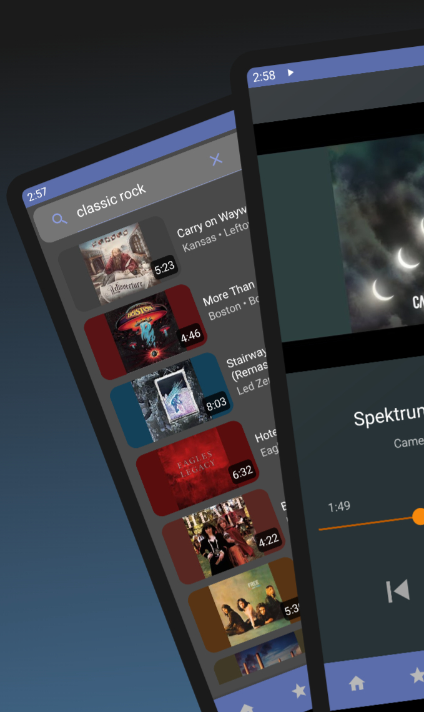
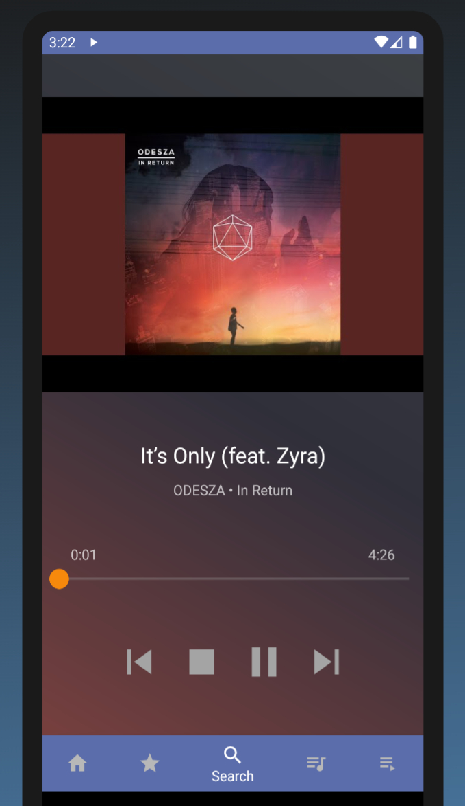

# Apollo Music

  
   

Apollo is a simple music streaming app for Android that is able to stream, search, and manage playlists from YouTube Music and YouTube. It was built as a personal project from 2019 to 2021 to create a free daily-driver music app that utilizes reverse engineered YouTube API calls without using any offical YouTube API keys. This allows the app to get around rate limits and other normal usage restrictions, such as lack of direct access to content streams.

This project is currently in an "archived" status and as such is no longer under any active development. It is being shared here as a reference for anyone who may find it interesting or useful. As of October 2023, the app still builds and fully works with YouTube.

## Architecture

Apollo implements the legacy [Android audio app](https://developer.android.com/guide/topics/media/legacy/audio) architecture and design pattern, which was the latest standard at the time of development.